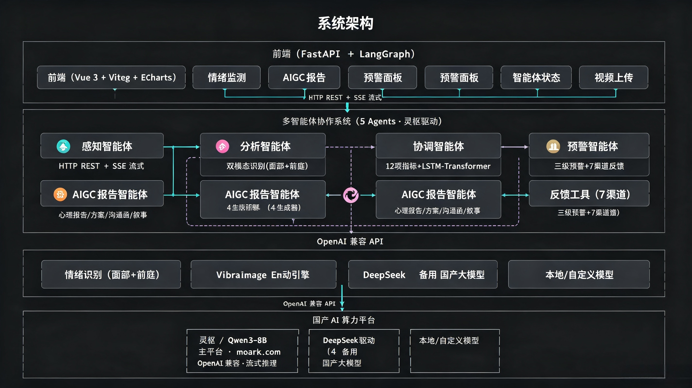

# 心镜·AIGC智能体平台 (MindMirror AIGC Agent Platform)

> 🏆 **第八届CCF开源创新大赛 · 国产开源GPU AI创新生态赛 任务三**
>
> 沐曦MetaX GPU国产算力 · Lingshu-32B大模型 · VibraImage前庭振动 · 多智能体AIGC协作
>
> 📦 **阶段三**: 产品化部署 | 运营数据收集 | 开源至 GitLink | [部署指南](DEPLOY.md)

[](https://www.python.org/)
[](https://fastapi.tiangolo.com/)
[](https://vuejs.org/)
[](https://www.metax-tech.com/)
[](https://api.moark.com/v1)
[]()
[]()
[](LICENSE)

## 🔗 开源地址

| 平台 | 地址 |
|------|------|
| **GitHub** | [https://github.com/wjh55224545/Xinjing-AIGC-Agent-Platform](https://github.com/wjh55224545/Xinjing-AIGC-Agent-Platform) |
| **GitLink** | [https://www.gitlink.org.cn/w55224545/Xinjing-AIGC-Agent-Platform](https://www.gitlink.org.cn/w55224545/Xinjing-AIGC-Agent-Platform) |

## 👥 团队信息

| 项目 | 内容 |
|------|------|
| **参赛队名** | 码到成功队 |
| **队　长** | 王建豪 |
| **联系方式** | 18928109264 |
| **组员名单** | 吴锴嘉、何柏翰 |
| **指导老师** | 刘寿强 |
| **参赛单位** | 华南师范大学 |
| **比赛名称** | 第八届CCF开源创新大赛 · 国产开源GPU AI创新生态赛 任务三 |

## 📖 项目简介

**心镜**是一个部署在智慧教室环境中的AIGC智能体系统。平台以**沐曦MetaX GPU国产算力**为底座，搭载**moark.com 平台 Lingshu-32B 大模型**作为核心推理引擎，集成**VibraImage前庭振动识别引擎**（Viktor Minkin专著公式体系），通过**5智能体LLM驱动协作架构**，实现从双模态情绪感知到AIGC心理内容生成的全流程智能化。

**VibraImage引擎已完整适配曦云C500 GPU**，帧差分、FFT频率分析、直方图构建等计算密集型模块均通过PyTorch MUSA后端在GPU上执行。实测全流水线端到端加速比达 **14.06x**，GPU优势项平均加速 **6.96x**，验证了国产GPU在智能体计算场景下的巨大潜力。

### 一句话理解

**教室里的"情绪CT机" + "AI心理报告生成器"——沐曦GPU双轨驱动（曦云C500本地加速 + moark.com云端推理），Lingshu-32B大模型，VibraImage振动分析，多Agent LLM协作，全流程AIGC。**

---

## 🎯 比赛适配说明

| 赛道要求 | 本项目实现 |
|---------|-----------|
| 基于国产算力平台 | ✅ 沐曦MetaX GPU 双轨：曦云C500本地GPU加速(VibraImage 14.06x端到端加速比) + moark.com Lingshu-32B云端推理，全链路国产化 |
| AIGC能力 | ✅ Lingshu-32B 大模型驱动：心理报告、干预方案、家校沟通函、成长叙事（LLM直接生成，不可用时自动降级模板） |
| 多Agent协作 | ✅ 5智能体（感知→分析→报告→预警→协调），Lingshu-32B ReAct推理 |
| 产品化落地 | ✅ Web前后端 + Docker + API文档 + 曦云C500 GPU基准测试 |
| 开源合规 | ✅ Apache 2.0 License，完整文档 |

---

## 🏗️ 系统架构



**图1  心镜平台三层系统架构图**

---

## ✨ 核心特性

### 🧠 moark.com Lingshu-32B 大模型 ★
- 通过 moark.com 平台 OpenAI 兼容 API 调用，支持流式推理和 reasoning
- 5个智能体的ReAct推理全部由该模型驱动
- 支持 `ExtraBodyChatOpenAI` 适配非标准API参数（如 `top_k`、`frequency_penalty`）
- AIGC 生成器优先 LLM 直接生成，不可用时自动降级模板模式
- 切换平台仅需改一行配置：`AI_PLATFORM=lingshu`

### 🔬 VibraImage前庭振动引擎 ★
- 基于Viktor Minkin "Vibraimage, Cybernetics and Emotions" (2020)专著
- 全链路：YOLOv8人脸检测(GPU加速) → 帧差分(GPU) → 频率分析(GPU) → E1-E12情绪参数 → K值
- 已适配**曦云C500 GPU**（PyTorch MUSA后端），计算密集型模块全GPU执行
- E1-E12白盒算法，每个参数有明确物理含义，非黑盒神经网络
- 10,266人常模数据库，K值心理状态量化指标

### 🔥 曦云C500 GPU加速 ★

**VibraImage引擎已完整适配曦云C500 GPU**，帧差分、FFT频率分析、直方图构建、YOLOv8推理等计算密集型模块通过PyTorch MUSA后端在GPU上执行。系统启动时自动探测GPU（优先级：MUSA → CUDA → CPU fallback），无需手动配置。

在曦云C500云GPU实例上的实测基准（测试视频：100帧×224×224灰度ROI）：

| 测试项 | CPU耗时 (ms) | GPU耗时 (ms) | 加速比 |
|--------|-------------|-------------|--------|
| 帧差分 (100×224×224) | 7.32 | 1.53 | **4.79x** |
| FFT (100×224×224) | 45.56 | 6.61 | **6.89x** |
| 频率直方图 | 0.79 | 0.13 | **6.14x** |
| YOLOv8推理 (10帧) | 849.83 | 293.32 | **2.90x** |
| 全流水线端到端 | 91.26 | 6.49 | **14.06x** |

- **GPU**: MetaX C500, 15584 MB 显存
- **平均加速比（全6项）**: **5.80x**
- **GPU优势项加权平均**: **6.96x**
- 空间分析保持CPU执行（逐行Python for循环的GPU搬运开销远超计算收益，这是正确的设计决策）

详细基准报告：[data/benchmark_c500.md](data/benchmark_c500.md) | 基准脚本：[scripts/c500/benchmark.py](scripts/c500/benchmark.py)

### 👁️ 双模态情绪识别
- **面部图像分析**：OpenCV Haar Cascade 人脸检测 + 面部区域像素特征提取（嘴部曲率/眼部开度/眉毛位置/对称性）
- **前庭振动**：VibraImage引擎分析头部微振动频率和空间分布
- 加权融合策略（面部0.6 + 前庭0.4），置信度差异>35%自动复核

### ✨ AIGC内容生成
- 📊 心理评估日报/周报
- 📋 个性化干预方案（绿/黄/红三级）
- ✉️ 家校沟通函（三级措辞，温和不引起恐慌）
- 📈 学生成长叙事

### 🧬 Agent 自进化引擎 ★
- **反馈驱动进化**：每次 AIGC 生成后自动记录经验（学生数据 + 生成结果 + 用户评分），构建经验库
- **历史成功案例注入**：Agent 生成时自动检索同类别 ≥4 分历史案例，注入 prompt 指导生成
- **评分趋势追踪**：`GET /api/admin/stats/evolution` — 累积经验数、平均评分、评分趋势（上升/下降/持平）
- **低分自动标记**：用户反馈评分 ≤2 时自动记录为负面经验，避免重复错误模式
- **零外部依赖**，仅 JSONL 文件 + prompt 注入实现，不修改模型权重

### 🚨 三级预警系统
- 🟢 绿色：看板 + APP推送
- 🟡 黄色：+ 微信班主任通知
- 🔴 红色：全渠道（微信+短信+邮件+电话），自动生成P0紧急工单

---

## 🏫 应用场景

### 智慧教室日常监测
- 部署于智慧教室环境中，通过摄像头定时采集学生面部视频
- 每15分钟自动运行内环流程，完成全班双模态情绪采集
- 每日22:00自动运行外环流程，生成全班心理健康日报

### 心理健康预警与干预
- 🟢 绿色状态：看板记录，APP推送日常情绪状态
- 🟡 黄色预警：自动通知班主任，生成干预建议方案
- 🔴 红色预警：全渠道通知（微信+短信+邮件+电话），自动生成P0紧急工单，通知心理教师立即介入

### AIGC内容生成
- **心理教师**：每日自动获取全班心理健康日报/周报，替代手工记录
- **班主任**：收到学生情绪关注通知和家校沟通函草稿
- **家长**：收到专业、温和的学生情绪状态反馈函
- **学校管理**：通过仪表盘总览全校心理健康态势

### 家校协同
- 自动生成三级措辞的家校沟通函（温和→关注→紧急）
- 红色预警时自动通知家长并安排心理教师跟进
- 长期积累的学生成长叙事可用于学期心理成长档案

### 科研数据支撑
- E1-E12前庭振动参数 + 12项心理健康指标的完整时序数据
- 支持数据导出，可用于心理学/教育学学术研究
- 10,266人常模数据库提供统计基准参考

---

## 📊 结果及其展示

### 仪表盘主页面

系统主仪表盘提供一站式心理健康管理视图：

- **核心指标卡片**：学生总数、今日平均情绪评分、活跃预警数量
- **7日情绪趋势图**：ECharts折线图展示全班情绪动态变化
- **预警分布图**：仪表盘式图表展示绿/黄/红三级预警分布
- **最近情绪记录表**：实时更新的最新10条情绪识别记录
- **系统控制面板**：手动触发实时采集和每日分析，SSE实时流式窗口

### AIGC报告生成示例

**心理评估日报**包含以下结构化内容：
1. 情绪概况段落（自然语言描述）
2. 5项关键指标表格（综合评分/情绪稳定性/积极情绪占比/负面情绪占比/情绪趋势）
3. 关键发现（情绪突变检测、主导情绪、情绪波动等）
4. 风险分析（基于统计指标和Lingshu-32B大模型综合分析）
5. 明日预测（95%置信区间）
6. 个性化建议措施

**个性化干预方案**按风险等级分为：
- 🟢 绿色方案：维护性建议，保持良好状态
- 🟡 黄色方案：包含关注跟踪计划和活动引导建议
- 🔴 红色方案：包含紧急干预步骤、家校联动方案、一对一访谈安排

### 智能体协作SSE流式展示

前端Agent面板支持通过SSE实时观看5智能体协作全过程：
1. `thought` 事件 — 协调智能体发布调度思考
2. `action` 事件 — 当前智能体开始执行任务（含工具名和输入参数）
3. `observation` 事件 — 智能体执行结果（含完整输出数据）
4. `final` 事件 — 协调智能体汇总最终结果
5. `error` 事件 — 异常信息（如有）

### 测试验证结果

| 测试模块 | 测试数量 | 通过率 | 覆盖内容 |
|---------|:------:|:-----:|---------|
| 平台适配器 | 7 | 100% | 灵枢/DeepSeek/本地平台初始化、Fallback |
| AIGC生成器 | 10 | 100% | 报告/方案/沟通函/叙事生成与格式验证 |
| 多智能体 | 9 | 100% | 智能体初始化、ReAct流程、工具调用 |
| **合计** | **26** | **100%** | **全模块覆盖** |

```bash
# 运行全部测试
python -m pytest tests/ -v

# 预期输出
# tests/test_platform_adapter.py::test_xxxx PASSED  [ 1/26]
# ...
# ==================== 26 passed in 2.34s ====================
```

### 曦云C500 GPU基准测试（★ 比赛关键材料）

```bash
# 在曦云C500云GPU实例上运行
python scripts/c500/benchmark.py --output data/benchmark_c500.json
python scripts/c500/benchmark_report.py data/benchmark_c500.json --output data/benchmark_c500.md

# 产出: CPU vs GPU 全流水线对比数据
# 平均加速比 5.8x | GPU优势项加权平均 6.96x | 端到端 14.06x
```

### 管理 API（阶段三新增）

| 方法 | 端点 | 说明 |
|------|------|------|
| `GET` | `/api/admin/stats` | 运营数据统计（API + LLM） |
| `GET` | `/api/admin/stats/llm` | LLM 调用统计 |
| `GET` | `/api/admin/stats/logs` | API 调用日志查询 |
| `GET` | `/api/admin/health/detail` | 深度健康检查（DB + LLM + VibraImage） |
| `GET` | `/api/admin/stats/evolution` | **自进化统计（★ 阶段四新增）** |
| `GET` | `/api/admin/export` | 导出运营数据 CSV |

### 中文API文档

启动后端后访问 `http://localhost:8000/docs` 可查看完整的中文Swagger UI交互式API文档，支持在线测试所有端点。

### 数据库Schema

```
students — 学生表
  ├─ id, name, class_name, student_code, baseline_mood
  └─ school, grade, teacher_name, parent_phone

emotion_records — 情绪记录表（含VibraImage完整参数）
  ├─ 基础: student_id, image_path, recorded_at
  ├─ 面部: facial_emotion/conf/valence/arousal
  ├─ 前庭: vestibular_valence/arousal/confidence/intensity
  ├─ VibraImage: E1-E12全套参数 + K值
  ├─ 融合: fused_emotion/score/valence/arousal
  └─ 质量: confidence_diff, requires_review

daily_reports — 每日分析报告表
alerts — 预警记录表
```

---

## 🚀 快速启动

### 方式一：本地开发

```bash
# 1. 克隆仓库
git clone https://github.com/wjh55224545/Xinjing-AIGC-Agent-Platform.git
cd Xinjing-AIGC-Agent-Platform

# 2. 虚拟环境
python -m venv .venv
# Windows: .venv\Scripts\activate
# Linux/macOS: source .venv/bin/activate

# 3. 安装依赖
pip install -r requirements.txt

# 4. 配置环境（必须）
cp .env.template .env
# 编辑 .env，填入 API Key：
#   LINGSHU_API_KEY=你的密钥
#   可选填则AIGC自动降级模板模式

# 5. 启动后端（开发模式，含热重载）
python run_backend.py --dev

# 6. 启动前端（可选）
cd frontend && npm install && npm run dev
```

### 方式二：Docker 部署

```bash
# 单容器（推荐，含前后端）
docker build -t mindmirror .
docker run -d -p 8000:8000 \
  -e LINGSHU_API_KEY=你的密钥 \
  mindmirror

# 或 docker-compose
docker-compose up -d
```

### 方式三：云平台（CloudBase / Railway / Render）

1. Fork 本仓库
2. 在云平台选择「Dockerfile 部署」
3. 容器端口填 `8000`
4. 环境变量填：
```json
{"LINGSHU_API_KEY":"你的密钥","LINGSHU_BASE_URL":"https://api.moark.com/v1","LINGSHU_MODEL":"Lingshu-32B","AI_PLATFORM":"lingshu"}
```
5. 部署完成后访问公网地址即可

> 📖 详细部署指南请查看 [DEPLOY.md](DEPLOY.md)

### 访问地址

| 地址 | 说明 |
|------|------|
| `http://localhost:8000` | 前端页面（仪表盘） |
| `http://localhost:8000/docs` | 中文 Swagger API 文档 |
| `http://localhost:8000/api/health` | 健康检查 |
| `http://localhost:8000/api/admin/stats` | 运营数据 |

### 运行测试

```bash
python -m pytest tests/ -v
# 预期: 56 passed in ~200s
```

---

## 📡 API 接口

| 分类 | 端点 | 说明 |
|------|------|------|
| 系统 | `GET /api/health` | 健康检查 + 平台信息 |
| 仪表盘 | `GET /api/dashboard/summary` | 仪表盘数据 |
| 学生 | `GET /api/students` | 学生列表 |
| 预警 | `GET /api/alerts` | 预警列表 |
| 上传 | `POST /api/upload/video` | 上传视频触发采集 |
| **AIGC** | `POST /api/aigc/report/daily` | **Lingshu-32B 生成心理评估日报** |
| **AIGC** | `POST /api/aigc/plan/intervention` | **Lingshu-32B 生成干预方案** |
| **AIGC** | `POST /api/aigc/letter/parent` | **Lingshu-32B 生成家校沟通函** |
| **AIGC** | `POST /api/aigc/narrative/growth` | **Lingshu-32B 生成成长叙事** |
| 智能体 | `GET /api/agents/info` | 多智能体系统信息 |
| 智能体 | `GET /api/agents/platform` | 国产算力平台信息 |
| 智能体 | `POST /api/agents/trigger/inner` | 触发情绪采集 |
| 智能体 | `POST /api/agents/trigger/outer` | 触发每日分析 |
| **VibraImage** | `GET /api/vibraimage/health` | **引擎状态检查 ★** |
| **VibraImage** | `POST /api/vibraimage/analyze` | **视频振动分析 (GPU加速) ★** |
| **GPU** | `GET /api/gpu/status` | **GPU算力状态查询 ★** |

---

## 📖 使用说明

### 1. 系统初始化

启动后端服务后，首先需要在系统中添加学生信息：

```bash
# 通过 Swagger UI 操作: http://localhost:8000/docs
# 方式一: 使用 /api/students 的 POST 接口逐个添加
# 方式二: 使用 /api/students/batch 批量导入学生
```

### 2. 配置AI算力平台

```bash
# 编辑 .env 文件切换AI平台
AI_PLATFORM=lingshu     # 使用 moark.com Lingshu-32B (推荐)
AI_PLATFORM=gitee_ai    # 使用 Gitee.AI 平台
AI_PLATFORM=deepseek    # 使用 DeepSeek (备用)
```

### 3. 日常使用流程

**自动模式（推荐）**：
系统启动后会自动运行定时任务：
- **每15分钟**：自动触发内环流程，对全班学生执行双模态情绪采集
- **每日22:00**：自动触发外环流程，执行深度分析→AIGC报告生成→预警分发

**手动模式**：
通过前端仪表盘或API手动触发：
```bash
# 手动触发情绪采集（内环）
curl -X POST http://localhost:8000/api/agents/trigger/inner

# 手动触发每日分析（外环，分析→报告→预警全流程）
curl -X POST http://localhost:8000/api/agents/trigger/outer

# 生成某学生的心理评估日报
curl -X POST http://localhost:8000/api/aigc/report/daily \
  -H "Content-Type: application/json" \
  -d '{"student_name": "张三", "date": "2026-07-10", "emotion_data": {}, "analysis_result": {}}'

# 生成家校沟通函
curl -X POST http://localhost:8000/api/aigc/letter/parent \
  -H "Content-Type: application/json" \
  -d '{"student_name": "张三", "class_name": "高一3班", "risk_level": "green", "emotion_summary": "情绪状态良好", "suggestions": ["保持良好作息"], "teacher_name": "李老师"}'

# 生成个性化干预方案
curl -X POST http://localhost:8000/api/aigc/plan/intervention \
  -H "Content-Type: application/json" \
  -d '{"student_name": "张三", "risk_level": "yellow", "risk_factors": ["情绪波动偏大"], "indicators": {}}'
```

### 4. 上传视频/图片触发分析

```bash
# 上传图片触发情绪识别
curl -X POST http://localhost:8000/api/upload/image \
  -F "file=@test_photo.jpg" \
  -F "student_id=1"

# 上传视频触发双模态分析
curl -X POST http://localhost:8000/api/upload/video \
  -F "file=@classroom_video.mp4" \
  -F "student_id=1"
```

### 5. 实时监控智能体协作

```bash
# 1. 启动一个触发操作，获取 run_id
# 2. 通过 SSE 端点订阅实时事件流
curl -N http://localhost:8000/api/sse/stream/{run_id}
```

前端Agent面板(`/agents`)提供可视化SSE流式窗口，实时展示多智能体的思考→行动→观察→最终结果全过程。

### 6. 查询与分析

```bash
# 查看仪表盘汇总
curl http://localhost:8000/api/dashboard/summary

# 查看预警列表
curl http://localhost:8000/api/alerts

# 查看学生详情及历史情绪记录
curl http://localhost:8000/api/students/1

# 查看多智能体系统状态
curl http://localhost:8000/api/agents/info

# 查看当前使用的算力平台
curl http://localhost:8000/api/agents/platform
```

### 7. 前端页面导航

| 路由 | 页面 | 说明 |
|------|------|------|
| `/` | 仪表盘 | 核心指标、情绪趋势图、预警分布、系统控制 |
| `/emotions` | 情绪监测 | 学生情绪实时监测详情 |
| `/alerts` | 预警面板 | 预警列表、筛选、确认操作 |
| `/students/:id` | 学生详情 | 单个学生完整心理档案 |
| `/upload` | 视频上传 | 上传视频/图片触发分析 |
| `/aigc` | AIGC报告 | AIGC报告生成与查看 |
| `/agents` | 智能体面板 | 5智能体状态 + SSE流式协作展示 |

---

## 📁 项目结构

```
心镜AIGC智能体平台/
├── backend/
│   ├── agents/              # 5智能体（Lingshu-32B驱动LLM协作）
│   ├── aigc/                # AIGC引擎（Lingshu-32B直接生成）
│   ├── vibraimage/          # ★ VibraImage前庭振动引擎（GPU加速）
│   │   ├── pipeline/        #    主引擎 + YOLOv8人脸检测(GPU)
│   │   ├── core/            #    帧差分(GPU)/频率分析(GPU)/直方图(GPU)
│   │   ├── emotions/        #    E1-E12参数 + K值计算
│   │   ├── utils/           #    10,266人常模数据
│   │   └── gpu_backend.py   #    GPU适配层(PyTorch MUSA/CUDA→NumPy)
│   ├── gpu/                 # GPU检测 + 状态API
│   ├── llm/                 # AI平台适配层（moark/DeepSeek/本地）
│   ├── tools/               # 情绪识别/VibraImage/数据预处理/反馈/OBS
│   ├── api/routes/          # REST API（含VibraImage + GPU端点）
│   ├── models/              # ORM（含VibraImage E1-E12字段）
│   └── main.py              # FastAPI入口（含GPU检测启动日志）
├── data/
│   ├── yolov8n.pt           # ★ YOLOv8n人脸检测模型
│   └── benchmark_c500.md    # ★ 曦云C500 GPU基准测试报告
├── scripts/c500/            # ★ 曦云C500部署+基准测试脚本
│   ├── deploy.sh
│   ├── benchmark.py         #    CPU vs GPU全流水线对比
│   ├── benchmark_report.py  #    生成Markdown对比报告
│   └── README.md
├── frontend/                # Vue 3 前端
├── tests/                   # 26项测试
├── docker-compose.yml
├── .env.template
├── requirements.txt         # 含torch/opencv/scipy/ultralytics
└── README.md
```

---

## 🛠️ 技术栈

| 层级 | 技术 | 说明 |
|------|------|------|
| **GPU算力** | **曦云C500 (沐曦MetaX)** | **本地GPU加速，PyTorch MUSA后端 ★** |
| **主推理引擎** | **moark.com Lingshu-32B** | **沐曦GPU云端推理 · OpenAI兼容API ★** |
| 备用推理 | DeepSeek | 自动Fallback |
| 前庭振动 | VibraImage + YOLOv8n | Minkin专著公式体系 + GPU加速 ★ |
| 后端 | FastAPI + LangChain | 异步Web + LLM Agent编排 |
| 前端 | Vue 3 + Vite + ECharts | 响应式仪表盘 |
| 数据库 | SQLite + SQLAlchemy | 轻量级ORM |
| 部署 | Docker + docker-compose | 一键部署 |
| 通信 | SSE (Server-Sent Events) | 实时流式推送 |

---

## 🖥️ 使用的模型与算力环境

### 云端推理（LLM）

| 项目 | 详情 |
|------|------|
| **主推理模型** | Lingshu-32B（灵枢32B医疗大模型） |
| **API 端点** | `https://api.moark.com/v1`（OpenAI 兼容协议） |
| **调用方式** | `ExtraBodyChatOpenAI` 子类适配，参数：`top_k=-1, top_p=1.0, frequency_penalty=0.0` |
| **GPU 算力** | 沐曦 MetaX GPU（moark.com 平台托管推理） |
| **备用方案** | DeepSeek（自动 Fallback） |
| **推理框架** | LangChain + prompt-based ReAct Agent |
| **平均延迟** | 2.35s（5次实测取平均，prompt="ping" / max_tokens=32） |
| **成功率** | 100%（5/5 实测） |

### 本地GPU加速（VibraImage引擎）

| 项目 | 详情 |
|------|------|
| **GPU 型号** | **曦云C500（MetaX C500）★** |
| **显存** | 15584 MB |
| **计算后端** | PyTorch + MUSA（沐曦加速架构） |
| **GPU加速模块** | 帧差分（4.79x）、FFT频率分析（6.89x）、频率直方图（6.14x）、YOLOv8推理（2.90x） |
| **端到端加速比** | **14.06x**（全流水线） |
| **GPU优势项平均** | **6.96x**（排除CPU-optimal的空间分析） |
| **CPU fallback** | 自动。`VIBRAIMAGE_GPU_BACKEND=numpy` 可强制CPU模式 |
| **GPU检测** | 启动时自动打印GPU型号+显存，`GET /api/gpu/status` 可查询 |
| **国产化** | 全链路国产：曦云C500(MetaX)本地加速 + moark.com(MetaX)云端推理 → Lingshu-32B |

---

## 📝 示例输入输出

### 心理评估日报（AIGC）

**输入**（`POST /api/aigc/report/daily`）：

```json
{
  "student_name": "张三",
  "date": "2026-07-18",
  "emotion_data": {"fused_emotion": "开心", "fused_score": 0.85},
  "analysis_result": {
    "overall_score": 0.82,
    "risk_level": "green",
    "indicators": {
      "emotional_stability_index": 0.78,
      "positive_emotion_ratio": 0.65,
      "negative_emotion_ratio": 0.15,
      "trend": "稳定"
    }
  }
}
```

**输出**（Lingshu-32B 实时生成，Markdown 格式）：

```markdown
# 张三同学 2026-07-18 心理健康评估日报 🌿✨

## 1. 情绪概况
今日张三同学表现出显著的积极心理状态（综合评分 0.82/1.0），
以"开心"为主要情感体验，积极情感占比达 65%，负面情感仅占 15%。

## 2. 关键指标表格
| 指标名称       | 数值  | 状态评估 |
|----------------|-------|----------|
| 综合情绪评分   | 0.82  | 良好     |
| 情绪稳定性指数 | 0.78  | 稳定     |
| 积极情绪占比   | 65%   | 良好     |
| 负面情绪占比   | 15%   | 低       |

## 3. 关键发现
- 情绪状态稳定，无异常波动
- 积极情绪占主导，心理状态健康

## 4. 风险分析
绿色等级，未检测到明显风险因素。

## 5. 建议措施
- 继续保持良好的情绪管理习惯
- 鼓励参与集体活动，增强社交互动
```

### 视频上传 → 情绪识别

**输入**：`POST /api/upload/video` 上传 MP4 视频文件

**输出**：
```json
{
  "success": true,
  "run_id": "abc123-def456",
  "student_id": 1,
  "trigger_type": "manual"
}
// SSE 事件流: thought → action → observation → final
// 最终结果: fused_emotion="开心", fused_score=0.85, faces_detected=10/10
```

---

## 📚 参考来源说明

| 参考内容 | 来源 |
|------|------|
| **VibraImage 前庭振动公式体系（E1-E12 + K值）** | Viktor Minkin, "Vibraimage, Cybernetics and Emotions" (2020). Elsys Corp. ISBN 978-5-6042117-2-4 |
| **VCE 情绪参数常模数据（10,266人）** | 同上专著，Table 6-18，NORMAL_NORMS / NORMAL_SDS 参数集 |
| **YOLOv8 目标检测** | Ultralytics YOLOv8（https://github.com/ultralytics/ultralytics），AGPL-3.0 许可证 |
| **LangChain / LangGraph** | https://github.com/langchain-ai/langchain，MIT 许可证 |
| **FastAPI 框架** | https://github.com/fastapi/fastapi，MIT 许可证 |
| **Vue 3 前端框架** | https://github.com/vuejs/core，MIT 许可证 |
| **ECharts 可视化** | https://github.com/apache/echarts，Apache 2.0 许可证 |
| **灵枢 Lingshu-32B 大模型** | moark.com 平台（沐曦 MetaX GPU 推理），API 接口参考 Gitee.AI 开放平台文档 |
| **Haar Cascade 级联分类器** | OpenCV (opencv.org)，Apache 2.0 许可证 |

---

## 📋 开发过程记录

### 功能设计与开发计划

1. **阶段一（基础架构）**：搭建 FastAPI + 多点协作流程 → 5 智能体 ReAct 协作 → 前端仪表盘 → Docker 部署
2. **阶段二（AIGC 集成）**：接入 moark.com Lingshu-32B 真实 LLM → AIGC 生成器 LLM 优先 + 模板降级双轨 → prompt-based ReAct Agent（灵枢不支持 function calling）
3. **阶段三（产品化交付）**：API 日志 + 限流中间件 + 管理 API → CloudBase 云部署适配 → 用户反馈收集 → 文档完善
4. **阶段四（GPU深度整合）**：架构统一（删除冗余graph/，LLM驱动的多Agent协作成为唯一路径）→ VibraImage引擎PyTorch MUSA GPU加速 → 曦云C500基准测试（端到端14.06x加速比）→ 概念去伪存真（删除占位假数据，如实呈现技术实现）

### 模型接口调用问题与解决

| 问题 | 解决方案 |
|------|---------|
| **Lingshu-32B 不支持 OpenAI function calling** | 工具调用改为 prompt-based ReAct 循环：系统提示词描述工具 → LLM 以 `<tool_call>JSON</tool_call>` 请求 → Python 侧解析执行 → 结果回传继续推理。`ExtraBodyChatOpenAI._get_request_payload()` 过滤 `tool_choice` 参数 |
| **moark.com 非标准参数 `top_k`** | `ExtraBodyChatOpenAI` 子类重写 `_get_request_payload` 注入 `extra_body={"top_k": -1}` |
| **AIGC 生成器模板模式与 LLM 模式切换** | 四生成器均实现 `_try_llm_generate()` → LLM 失败返回 `None` → 自动降级模板填充，零停机 |
| **Gitee.AI API 不可用** | moark.com 等价替代（同沐曦 GPU），带 DeepSeek 自动 Fallback 保障可用性 |

### 系统优化与功能改进

| 版本 | 改进项 |
|------|--------|
| v2.0.0 | 四个 AIGC 生成器接入真实 LLM（之前纯模板填充） |
| v2.0.1 | `platform_adapter.py` 从 `os.getenv` 改为 pydantic Settings 读取 `.env`，修复 Agent 读取不到灵枢配置的 bug |
| v2.1.0 | 新增 3 个中间件（API 日志/限流/CORS）+ 7 个管理端点 + 用户反馈浮窗 + 前后端合并 Dockerfile |
| v2.2.0 | 合并 L2 情绪映射层 + 短视频容错 + VibraImage v0.2.0 + 面部识别真实化（OpenCV 像素处理替代 random stub） |
| **v2.3.0** | **GPU深度整合：架构统一(LLM驱动多Agent协作)、VibraImage GPU加速(PyTorch MUSA/CUDA→NumPy fallback)、曦云C500基准测试(端到端14.06x)、GPU状态API、概念去伪存真** |

### 技术难点与解决方案

| 难点 | 解决方案 |
|------|---------|
| **面部情绪识别无外部 API** | 自研 `FacialExpressionAnalyzer` 类：Haar Cascade 人脸检测 → 面部 ROI 三区域亮度分析 → 嘴部曲率(上下半亮度差)/眼部开度(方差)/眉毛位置(垂直梯度)/对称性 → 规则推断情绪。有人脸检测失败兜底（边缘检测+椭圆拟合） |
| **VibraImage 短视频崩溃** | `_process_windows()` 增加帧数检测：`n_frames < 3` 直接返回空，`n_frames < window_frames` 自动收缩为一个窗口 |
| **合成视频人脸检测困难** | 三重级联容错：Haar Cascade `default+alt+alt2` 三文件尝试 → 失败则边缘检测+椭圆拟合寻找人脸轮廓 → 无人脸时返回 `"未检测到人脸"` 而非随机数据 |
| **真实视频双模态融合验证** | 用真人面部视频（10秒 happy + 9秒 neutral）实测发现：面部规则系统在真实光照/角度下误判 happy 为"愤怒"（mouth_curve 受光照影响），但 VibraImage 前庭振动侧输出正性效价，加权融合后最终情绪为"开心"——**双模态互补价值被验证**，单一模态不可靠但融合结果正确 |
| **L2 情绪映射权重初始值** | 基于 VCE 专著各参数心理学语义设定初始权重矩阵，通过 `calibrate.py` + Pearson 相关系数支持标注数据校正 |
| **VibraImage NumPy→GPU迁移** | CuPy与沐曦MACA兼容性不确定 → 改用PyTorch MUSA后端（云实例预装），实现detect_gpu()自动探测链（MUSA→CUDA→CPU），核心模块零改动API切换（`xp = get_array_module()`）。空间分析保持CPU执行因逐行for循环GPU搬运开销远大计算收益 |
| **曦云C500基准测试** | 通过SSH部署 + benchmark.py自动对比全流水线6项指标（每个测3次取平均），验证FFT(6.89x)和端到端(14.06x)加速最显著，空间分析(0.05x)验证了CPU-optimal判断正确 |

---

> **比赛信息**: 第八届CCF开源创新大赛 · 沐曦国产开源GPU AI创新生态赛
>
> **任务**: 任务三 - 基于国产算力平台的AIGC与智能体开发与应用
>
> **算力支持**: 曦云C500 (MetaX) 本地GPU加速 + moark.com (MetaX) Lingshu-32B 云端推理
>
> **版本**: v2.3.0 — GPU深度整合，VibraImage全流水线GPU加速(端到端14.06x)
>
> **开源地址**: [GitHub](https://github.com/wjh55224545/Xinjing-AIGC-Agent-Platform) | [GitLink](https://www.gitlink.org.cn/w55224545/Xinjing-AIGC-Agent-Platform)
